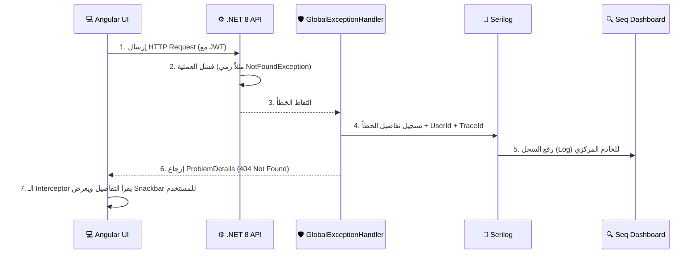
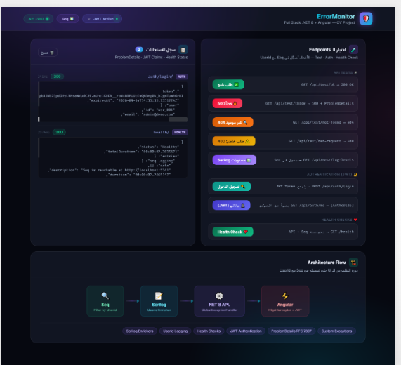
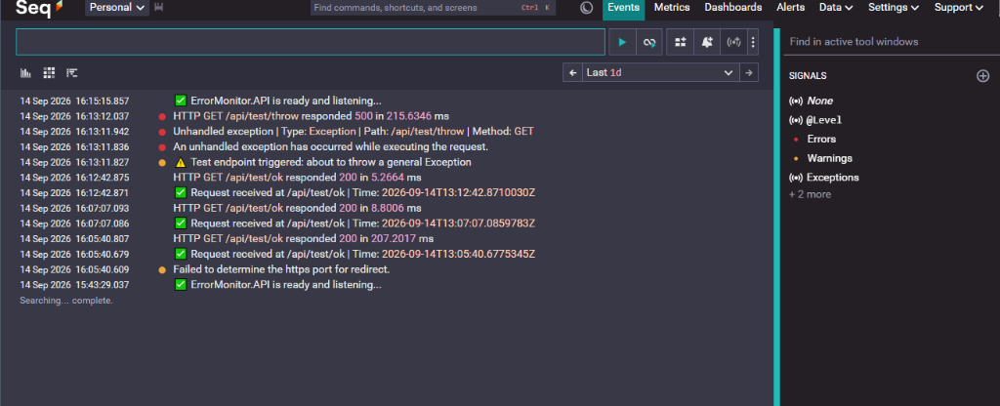
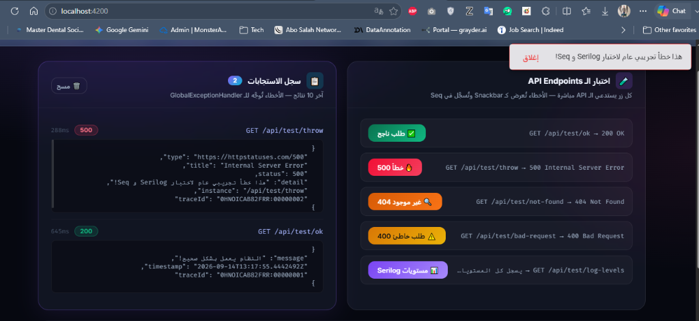
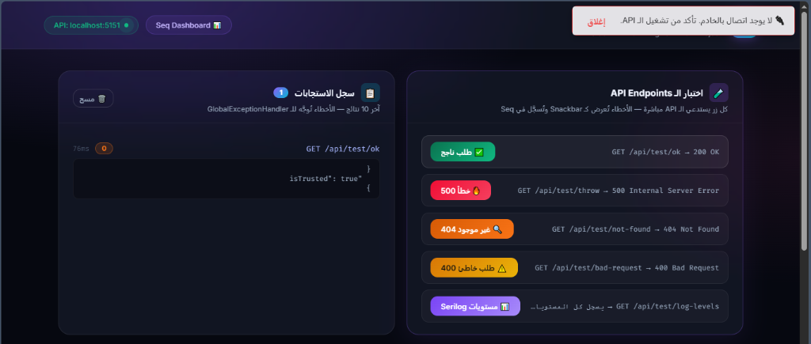

<div align="center">
  
# 🛡️ ErrorMonitor Full-Stack

**نظام متكامل لتسجيل ومراقبة الأخطاء (Centralized Logging) ومعالجتها بذكاء**


</div>

---

## 📖 عن المشروع

**ErrorMonitor** هو مشروع Full-Stack متقدم يهدف إلى حل مشكلة شائعة في بيئات العمل الحقيقية (Production): **تتبع الأخطاء بدقة ومعالجتها بطريقة موحدة**. 

بناءً على معايير `RFC 7807` (Problem Details for HTTP APIs)، يقوم النظام بالتقاط كافة الأخطاء غير المتوقعة (Exceptions) في الواجهة الخلفية، وتسجيلها مركزياً في خادم **Seq** باستخدام **Serilog** مع ربطها بهوية المستخدم (JWT UserId)، ثم إرجاع رسالة خطأ قياسية للواجهة الأمامية (Angular) ليتم عرضها للمستخدم بتجربة سلسة عبر الـ Functional Interceptors.

---

## 🚀 المميزات الأساسية (Features)

- **🧠 Global Exception Handling (.NET 8):** استخدام `IExceptionHandler` لاصطياد الأخطاء مركزياً بدون تلويث الكود بـ `try/catch`.
- **🎯 Custom Exceptions:** فئات أخطاء مخصصة مثل `NotFoundException` و `ValidationException` تقوم تلقائياً بإنشاء الـ HTTP Status Code المناسب.
- **📜 Centralized Logging (Serilog + Seq):** توجيه السجلات إلى Console و Files وخادم Seq السحابي، مع مستويات دقيقة (Debug, Info, Warn, Error, Critical).
- **🔐 JWT Authentication + User Logging:** تسجيل الدخول بـ JWT، واستخدام `UserEnricherMiddleware` لدمج `UserId` مع كل عملية تسجيل (Log) لتتبع أخطاء كل مستخدم على حدة.
- **❤️ Health Checks:** نقطة فحص `/health` تراقب حالة الـ API واتصال قاعدة البيانات/Seq وتُسجل النتائج تلقائياً.
- **⚡ Angular 17 Standalone:** واجهة حديثة خالية من الـ Modules مع Functional HTTP Interceptors لالتقاط أخطاء الـ API وعرضها تلقائياً عبر Notifications مخصصة.
- **🎨 Premium Cyberpunk UI:** تصميم حصري يعتمد على Glassmorphism، Mesh Gradients، و Neon Glow Effects.

---

## 🏗️ البنية التحتية (Architecture Flow)

يوضح المخطط التالي دورة حياة الطلب من لحظة إرساله عبر Angular، مروراً باصطياد الخطأ في .NET، وحتى ظهوره في Seq:



---

## 🛠️ التقنيات المستخدمة (Tech Stack)

### Backend (.NET 8)
- ASP.NET Core Web API
- `Microsoft.AspNetCore.Diagnostics.ExceptionHandler`
- `Serilog` & `Serilog.Sinks.Seq` & `Serilog.Sinks.File`
- `Microsoft.AspNetCore.Authentication.JwtBearer` (v9.0)
- `AspNetCore.HealthChecks.UI.Client`

### Frontend (Angular 17+)
- Angular Standalone Components
- Functional HTTP Interceptors
- Signals for State Management
- RxJS (finalize, catchError)
- SCSS (Custom Dark Premium Theme)

---

## 💻 كيفية التشغيل محلياً

### 1. المتطلبات الأساسية
- [.NET 8 SDK](https://dotnet.microsoft.com/download)
- [Node.js](https://nodejs.org/) (v18 أو أحدث)
- خادم [Seq](https://datalust.co/seq) (يمكن تثبيته محلياً أو استخدام النسخة السحابية)

### 2. تشغيل الواجهة الخلفية (Backend)
```bash
cd ErrorMonitor.API
dotnet restore
dotnet run
```
*سيعمل الـ API على المنفذ `http://localhost:5151`*

### 3. تشغيل الواجهة الأمامية (Frontend)
```bash
cd error-monitor-ui
npm install
ng serve -o
```
*سيعمل تطبيق Angular على المنفذ `http://localhost:4200`*

---

## 📸 نظرة على النظام

### 1. الواجهة الرئيسية (Premium Dashboard)


### 2. واجهة Seq لتتبع السجلات والأخطاء


### 3. معالجة الأخطاء الذكية (500 Internal Server Error)


### 4. انقطاع الاتصال (Connection Error)


---
*Developed as a Full-Stack CV Project to demonstrate enterprise-grade error handling and centralized logging capabilities.*
